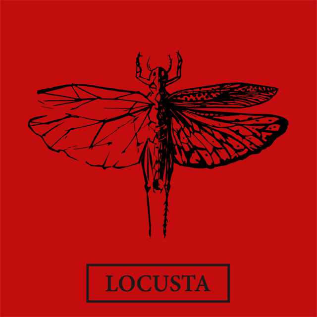

# Locusta

This is the main source code repository for the Locusta project.
It contains the library code implementation, documentation and an example benchmarking application using the [GoogleTest library](https://github.com/google/googletest).

## Building example application.

### Ubuntu & WSL
1. Install Dependencies
- CUDA & CUDA Toolkit. See [CUDA Quick start guide](https://docs.nvidia.com/cuda/cuda-quick-start-guide/index.html)

- CMake
> sudo apt-get install cmake

- Google Test
> sudo apt-get install libtgtest-dev

2. Run Cmake
> cmake -B build .

3. Compile test application
> cd Build
> make -j

## Building Documentation

### Ubuntu
1. Install Dependencies
- CMake
> sudo apt-get install cmake
- Doxygen
> sudo apt-get install doxygen
- Graphviz
> sudo apt-get install graphviz

2. Run Cmake
> cmake -B build .

3. Compile
> cd Build
> make doc

## Notes

A Massively Parallel Evolutionary Computation Metaheuristic Framework.

Locusta provides a framework to build various population based evolutionary metaheuristics.

The current implementation uses CUDA to describe massively parallel kernels, to
compute: the evaluation of the fitness function on a population of genomes, the
methaheuristic processes (ej. mutation, crossover) and the generation of
pseudorandom numbers.

The collection of metaheuristics also has a CPU parallel implementation, written
using OpenMP. Implementations are not design to perform invariant
transformation, between architectures. Given that each platform, implies a
different problem to solve in the data-oriented design, each implementation can
vary widely in implementation. The framework provides a way to compare and measure
the performance throughoutput of each implementation, taking into account the
strenghts of each targeted architecture.

| Metaheuristic Solver           | OMP |  CUDA |
|--------------------------------|-----|-------|
| Particle Swarm Optimization    | ✓   | ✓    |
| Genetic Algorithm              | ✓   | ✓    |
| Differential Evolution         | ✓   | ✓    |

## License

Locusta is distributed under the terms of the GNU Lesser General Public Licence

See [LICENSE-LGPL-3.0](LICENSE-LGPL-3.0)
